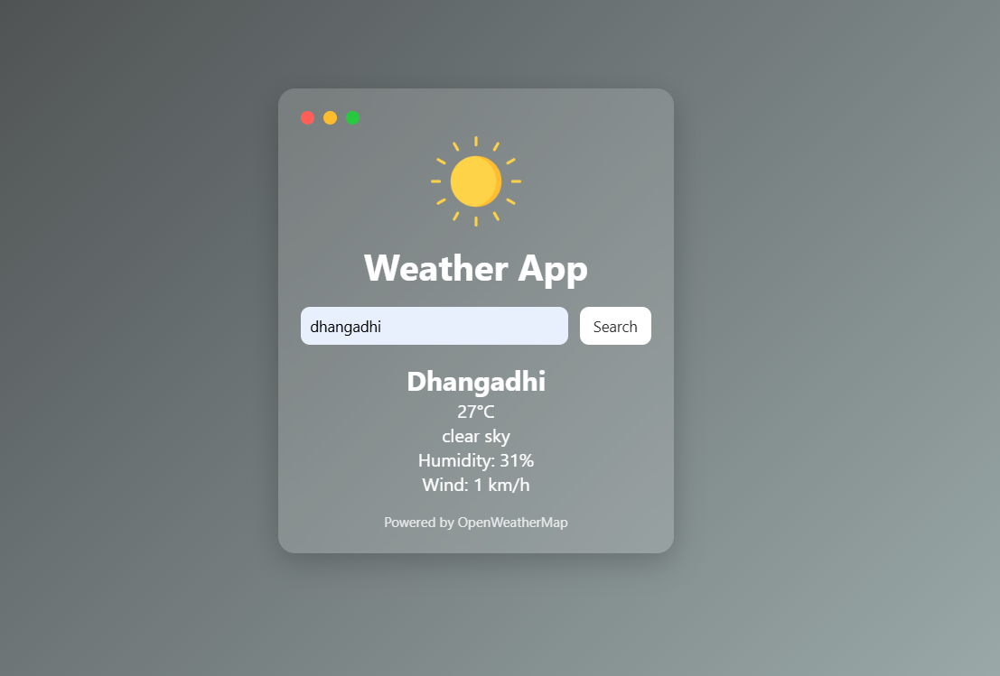

# 🌦️ Weather App

**Enter your city name and instantly get the current weather details using OpenWeatherMap API.**


---

## 🚀 Features

* Search weather by city name.
* Displays **temperature, weather condition, and details.**
* Simple and clean UI design.
* Powered by **OpenWeatherMap API.**

---

## 📸 Screenshot



---

## 📁 Project Structure

```
Weather-app/
│
├── index.html
├── style.css
├── app.js
└── screenshot.png
```

---

## ✍️ Author

* Dinesh Singh Dhami

* GitHub:  [Dinesh Singh Dhami](https://github.com/dineshsinghdhami)

* Linkedin: [Dinesh Singh Dhami](https://www.linkedin.com/in/dineshsinghdhami1/)

* Portfolio: [dineshsinghdhami.com.np](http://dineshsinghdhami.com.np/)

---

## 🌟 Contributing

* Feel free to fork this project, make improvements, and submit pull requests!

---

**Made with ❤️ by Dinesh Singh Dhami**
